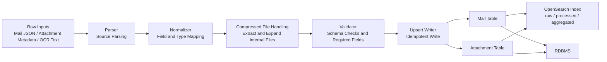

# 02_pipeline

> 대외비 보호를 위해 식별 정보는 제거했으며, 구조와 원칙을 익명화하여 설명합니다.

## Parsing & Normalization Pipeline (Mail / Attachment)

### End-to-End Flow (conceptual)

## Branch Rule
- 저장 분기: Mail Table, Attachment Table로 정규화 저장한다.
- sink 분기: OpenSearch는 검색/탐색 목적, RDB는 정합/조인 분석 목적이다.
- OpenSearch는 multi-stage index(raw / processed / aggregated)로 운영하되, 기본 메시지는 검색/탐색 경로로 유지한다.

## 압축파일 처리
- 압축파일은 메일 메타에서는 첨부 1건으로 유지하고, Normalizer에서 내부 파일을 모두 확장해 Attachment로 적재한다.
- 재처리 방식은 upsert이며, Mail은 `mail_id`, Attachment는 `attachment_id` 기준으로 멱등 반영한다.

---
대외비 보호를 위해 식별 정보는 제거했으며, 구조와 원칙을 익명화하여 설명합니다.
